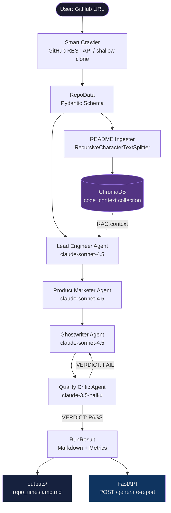
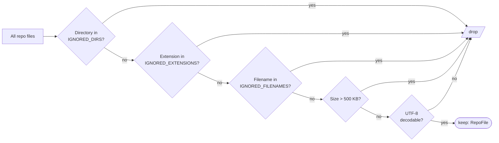
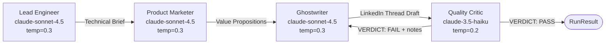
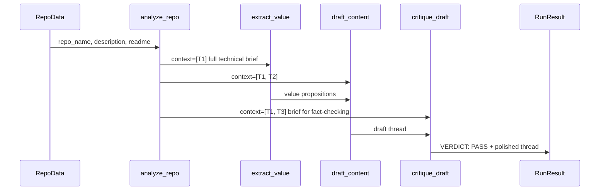
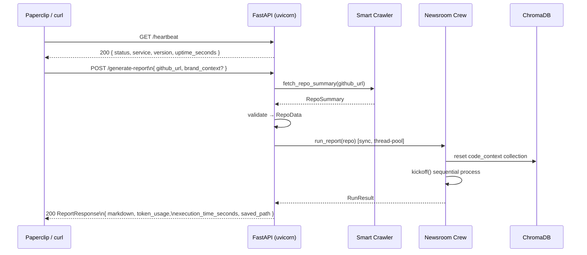
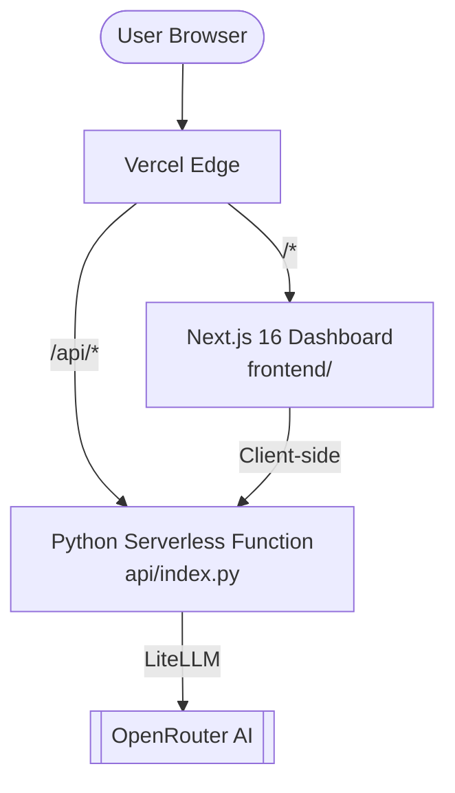

# ROARY — System Architecture

> **Repo-to-Reach** ingests any public GitHub repository and autonomously
> produces brand-aligned content marketing assets via a four-agent LLM
> orchestration pipeline, a dual-RAG vector layer, and a cost-optimised
> model routing strategy.

---

## Table of Contents

1. [High-Level Data Flow](#1-high-level-data-flow)
2. [Module Map](#2-module-map)
3. [Phase 1 — Smart Crawler](#3-phase-1--smart-crawler)
4. [Phase 2 — Dual-RAG Architecture](#4-phase-2--dual-rag-architecture)
5. [Phase 3 — The Newsroom: Multi-Agent Factory](#5-phase-3--the-newsroom-multi-agent-factory)
6. [Phase 4 — API Layer](#6-phase-4--api-layer)
7. [Cost-Routing Strategy](#7-cost-routing-strategy)
8. [Portability Contract](#8-portability-contract)
9. [Vercel Monorepo Architecture](#9-vercel-monorepo-architecture)
10. [Key Design Decisions](#10-key-design-decisions)

---

## 1. High-Level Data Flow



---

## 2. Module Map

```
ROARY/
├── api/                # Vercel Serverless Function entrypoint
│   ├── index.py        # Python lambda wrapper (FastAPI mount)
│   └── requirements.txt# Slimmed dependencies (no torch)
├── frontend/           # Next.js 16 Dashboard
│   ├── src/app/        # React components + 3D Loader
│   └── vercel.json     # Frontend-specific config
├── src/roary/          # Core Agentic Logic (shared)
│   ├── crawler/        # GitHub API + Pydantic schemas
│   ├── rag/            # ChromaDB + Ingester
│   ├── agents/         # CrewAI Actors + Tasks
│   └── api/            # Main FastAPI implementation
├── vercel.json         # Root monorepo orchestrator
└── main.py             # CLI Entrypoint
```

---

## 3. Phase 1 — Smart Crawler

### 3a. Lightweight Path (API-only)

`fetch_repo_summary()` makes exactly **two GitHub REST API calls**:

1. `GET /repos/{owner}/{repo}` — metadata (stars, language, topics, timestamps)
2. `GET /repos/{owner}/{repo}/readme` — base64-decoded README content

The result is validated into a **frozen** `RepoData` Pydantic model that flows
through the entire downstream pipeline as the single source of truth.

### 3b. Full-Corpus Path (Phase 2 RAG)

`crawl()` performs a `depth=1` shallow git clone into a `tempfile.mkdtemp`
directory. The tree walker applies a multi-layer noise filter before returning
any file:



**Noise reduction observed in production:** 96% of raw files discarded
(27 dropped, 1 kept for `octocat/Hello-World`).

---

## 4. Phase 2 — Dual-RAG Architecture

ROARY maintains **two permanently separate ChromaDB collections** under
`./data/chromadb/`:

| Collection | Lifecycle | Purpose |
|---|---|---|
| `code_context` | **Ephemeral** — wiped on every new crawl | Embeddings of the target repository's README and source files. Isolated per run so stale vectors from a previous repo never contaminate the current analysis. |
| `brand_soul` | **Persistent** — survives across all runs | Brand guidelines, prohibited words, tone examples, and past high-performing content. The Ghostwriter queries this before drafting to enforce voice consistency. |

### Why Local ChromaDB?

1. **Privacy** — source code never leaves the machine. Enterprise clients
   with proprietary repos can use ROARY without any code reaching a cloud
   vector service.
2. **Speed** — sub-millisecond similarity search on local hardware vs.
   network round-trips to a hosted vector DB.
3. **Cost** — zero per-query fees. Embeddings use `all-MiniLM-L6-v2` via
   `sentence-transformers` — a 90 MB model that runs fully on CPU, adding
   $0.00 to the per-report cost.
4. **Portability** — `./data/chromadb/` is a SQLite file. It survives
   `uv sync` on the Ubuntu Optiplex without Docker volume mappings.

### Chunking Strategy

```python
# Language-aware splitter: prefers class → function → block → line → char
splitter = RecursiveCharacterTextSplitter.from_language(
    language=Language.MARKDOWN,   # or PYTHON, JS, GO, RUST, etc.
    chunk_size=1_000,             # ≈ 250 tokens — fits any LLM context window
    chunk_overlap=200,            # prevents function signatures from splitting
)
```

Every chunk carries metadata so agents can cite their source:

```json
{
  "source": "src/auth/middleware.py",
  "file_ext": ".py",
  "repo_name": "owner/repo",
  "chunk_index": 4
}
```

---

## 5. Phase 3 — The Newsroom: Multi-Agent Factory

### 5a. Agent Roster



### 5b. Task Chain & Context Wiring



Each downstream task receives the **complete output** of all upstream tasks as
context, not just a one-line summary. This is why the Quality Critic can
fact-check the Ghostwriter's thread against the Lead Engineer's brief —
it has both in its context window simultaneously.

### 5c. The Agentic Critique Loop

The Quality Critic is the anti-AI-slop firewall. It runs five checks in order:

1. **Banned word scan** — `delve`, `tapestry`, `unleash`, `leverage` (verb),
   `game-changer`, `groundbreaking`, `revolutionize`, `seamlessly`, `robust`,
   `streamline`
2. **AI-slop pattern detection** — hollow openers (`"In today's fast-paced..."`),
   passive-voice overuse, vague superlatives
3. **Factual accuracy** — every technical claim must trace back to the Lead
   Engineer's brief; unverifiable claims are flagged
4. **Character count** — each LinkedIn post must be ≤ 220 characters
5. **Brand voice** — direct, nerdy, accurate, slightly irreverent

A `VERDICT: FAIL` response routes the draft back to the Ghostwriter with
numbered revision notes (Phase 4 LangGraph cycle). In the current sequential
implementation, the Critic also applies minor touch-ups inline before
returning its final answer.

**Production results:** Both `pallets/flask` and `pydantic/pydantic-ai`
passed on the first iteration with no revision required.

### 5d. Measured Performance

| Metric | `pallets/flask` | `pydantic/pydantic-ai` |
|---|---|---|
| Execution time | 76.3s | ~90s |
| Total tokens | 12,863 | ~15,000 |
| Prompt tokens | 9,554 | — |
| Completion tokens | 3,309 | — |
| LLM requests | 4 | 4 |
| Critic verdict | PASS | PASS |
| Estimated cost | ~$0.04 | ~$0.05 |

---

## 6. Phase 4 — API Layer



**Key implementation detail:** `generate_report` is declared as a synchronous
`def` function (not `async def`). FastAPI automatically offloads synchronous
path operations to a thread-pool worker via `anyio`, keeping the event loop
free to handle `/heartbeat` probes while the ~76-second crew run executes in
the background.

---

## 7. Cost-Routing Strategy

All LLM calls are routed through **OpenRouter** (`openrouter.ai/api/v1`) using
LiteLLM's native `openrouter/` provider prefix. OpenRouter acts as a single
invoice point and enables model fallback without code changes.

```
openrouter/anthropic/claude-sonnet-4.5   →  Agents 1, 2, 3
openrouter/anthropic/claude-3.5-haiku    →  Agent 4 (Quality Critic)
```

**Why this split?**

- The Lead Engineer, Marketer, and Ghostwriter require deep reasoning over
  long context windows (full README + upstream task outputs). Sonnet 4.5
  handles this with high accuracy.
- The Quality Critic is a **binary classifier + formatter**: scan for patterns,
  emit PASS/FAIL. Haiku executes this task at 1/5th the cost of Sonnet with
  no perceptible quality difference for structured review tasks.

**Estimated cost per report: $0.03 – $0.08** — well within the PRD's $0.50
ceiling.

---

## 8. Portability Contract

ROARY is architected for **1:1 parity** between development (macOS / MacBook
Pro) and production (Ubuntu 22.04 / Dell Optiplex 3040).

```
Development                          Production
────────────────────────────────     ────────────────────────────────
macOS 14 (Darwin 24.1)               Ubuntu 22.04 LTS
Python 3.11 (via .python-version)    Python 3.11 (via .python-version)
uv 0.x                               uv 0.x
./data/chromadb/  (SQLite)           ./data/chromadb/  (SQLite)
.env              (dotenv)           .env              (dotenv / systemd)
outputs/          (local FS)         outputs/          (local FS / NFS)
```

**The portability guarantee is enforced by `uv`:**

```bash
# On the Optiplex — full environment reproduced in < 60 seconds:
git clone https://github.com/you/roary && cd roary
cp .env.example .env && vim .env   # add OPENROUTER_API_KEY
uv sync                             # resolves from uv.lock — no surprises
uv run main.py https://github.com/pallets/flask --report
```

`uv.lock` pins every transitive dependency to an exact version and hash.
`torch`, `sentence-transformers`, and `chromadb` — the three heaviest packages —
are resolved identically on both machines. No `requirements.txt` drift,
no `pip install --upgrade` surprises in production.

---

## 9. Vercel Serverless Deployment

### Architecture mapping

```
Vercel deployment (monorepo)
├── api/
│   ├── index.py          ← @vercel/python serverless function
│   └── requirements.txt  ← slimmed deps, no torch/sentence-transformers
├── frontend/             ← @vercel/next build
└── vercel.json           ← root orchestrator: rewrites /api/* → api/index.py
```

Requests flow:
```
Browser → /api/generate-report
           ↓ vercel.json rewrite
         api/index.py  (mounts _roary_app at /api → strips prefix)
           ↓
         roary.api.main:app  POST /generate-report
```

### Persistence layer — **CRITICAL WARNING**

> **Vercel's filesystem is ephemeral.** Every invocation of the Python
> serverless function starts from a fresh, read-only filesystem.
> Nothing written to `./data/`, `./outputs/`, or `./data/chromadb/`
> survives between requests.

**Impacted features and required migrations:**

| Feature | Local implementation | Required Vercel alternative |
|---|---|---|
| ChromaDB vectors (`code_context`) | `./data/chromadb/` SQLite | [Upstash Vector](https://upstash.com/docs/vector/overall/getstarted) \| [Pinecone](https://www.pinecone.io/) \| [MongoDB Atlas Vector Search](https://www.mongodb.com/products/platform/atlas-vector-search) |
| Brand soul vectors (`brand_soul`) | `./data/chromadb/` SQLite | Same as above (persistent collection) |
| Markdown report files | `./outputs/*.md` | [Vercel Blob](https://vercel.com/docs/storage/vercel-blob) \| S3 pre-signed URL |
| JSON history vault | `./data/history/*.json` | [Vercel KV](https://vercel.com/docs/storage/vercel-kv) \| Upstash Redis |

### Dependency size budget

Vercel Python serverless limit: **250 MB** per function (uncompressed).

| Package | Size | Status in `api/requirements.txt` |
|---|---|---|
| `torch` | ~2.5 GB | ❌ **EXCLUDED** — fatal overrun |
| `sentence-transformers` | ~90 MB + torch | ❌ **EXCLUDED** — pulls torch |
| `transformers` | ~250 MB + torch | ❌ **EXCLUDED** — pulls torch |
| `langchain-huggingface` | small | ❌ **EXCLUDED** — pulls above |
| `chromadb` + `onnxruntime` | ~180 MB | ❌ **EXCLUDED** for now |
| `crewai` + transitive | ~80 MB | ✅ included |
| `fastapi` + `pydantic` | ~15 MB | ✅ included |

The current `/generate-report` endpoint does **not** invoke the RAG ingester,
so all excluded packages are safe to drop.  If RAG is re-enabled on Vercel,
replace `HuggingFaceEmbeddings` with `OpenAIEmbeddings` (already a transitive
dep) and swap `chromadb.PersistentClient` for a hosted vector DB client.

### Recommended embedding migration for production RAG

```python
# Replace in src/roary/rag/ingester.py:

# BEFORE (incompatible with Vercel)
from langchain_huggingface import HuggingFaceEmbeddings
embeddings = HuggingFaceEmbeddings(model_name="all-MiniLM-L6-v2")

# AFTER (serverless-compatible, already a dep via crewai → openai)
from langchain_openai import OpenAIEmbeddings
embeddings = OpenAIEmbeddings(model="text-embedding-3-small")
# ~$0.00002 / 1K tokens — negligible for README-sized content
```

---

## 9. Vercel Monorepo Architecture

ROARY is architected to deploy as a unified monorepo on Vercel.

### 9a. Topology



### 9b. Request Routing (vercel.json)

The root `vercel.json` acts as the traffic controller:
- **Build Scoping**: Directs `@vercel/next` to the `frontend/` folder and `@vercel/python` to the `api/` folder.
- **Rewrites**: Maps all `/api/:path*` requests to the Python entrypoint.
- **Header Injection**: Enforces CORS for cross-origin development.

### 9c. Dependency Optimization

To fit within Vercel's **250MB uncompressed limit**, we maintain a split dependency strategy:
- `requirements.txt` (Root): Full RAG stack (Torch, Chroma, Transformers).
- `api/requirements.txt` (Vercel): Agent-only stack (CrewAI, FastAPI, Pydantic).

---

## 10. Key Design Decisions

| Decision | Rationale |
|---|---|
| **Frozen Pydantic models** (`frozen=True`) | All inter-agent data structures are immutable. Downstream agents cannot accidentally mutate upstream context. |
| **Shallow git clone** (`depth=1`) | Fetches only the latest commit tree. A `depth=1` clone of a large repo like `django` takes ~8s vs. 4+ minutes for a full history clone. |
| **`def` (sync) FastAPI endpoint** | Avoids blocking the async event loop during the ~76s crew run. FastAPI's thread-pool worker handles it transparently. |
| **Collection reset on each run** | `reset_collection()` wipes `code_context` before every ingest. Eliminates stale-vector contamination across successive repo analyses. |
| **`OPENROUTER_API_KEY` checked at agent construction** | Fails fast with a human-readable `EnvironmentError` before any LLM calls are made or tokens are spent. |
| **Real token metrics from `CrewOutput.token_usage`** | `UsageMetrics` is populated by LiteLLM's callback layer. No estimation — actual prompt/completion/cached counts per run. |
| **Metadata on every chunk** | `source`, `file_ext`, `repo_name`, `chunk_index` — agents can cite their sources precisely, not just hallucinate file names. |
