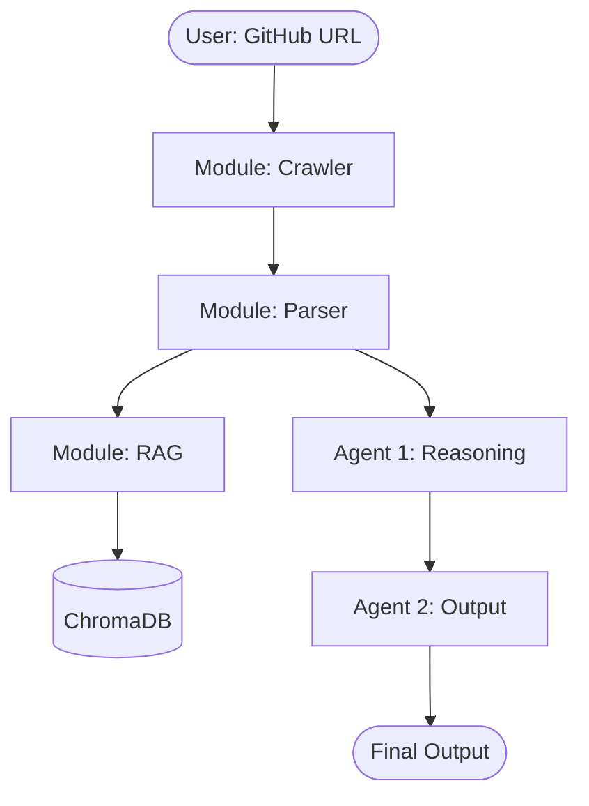

# System Architecture: [PROJECT_NAME]

> [Brief one-sentence description of the service and its purpose.]

---

## 1. High-Level Data Flow


---

## 2. Module Map
```
src/[PROJECT_NAME]/
│
├── crawler/         # Logic to fetch data (e.g., API or CLI)
├── data/            # Local data handling and models
├── agents/          # Multi-Agent setup and roles
├── api/             # FastAPI / Entry point logic
└── utils/           # Shared utility functions
```

---

## 3. Cost-Routing Strategy
All LLM calls are routed through **OpenRouter** (`openrouter.ai/api/v1`) using LiteLLM/OpenAI's provider prefix.

| Tier | Agent(s) | Model | Purpose |
|---|---|---|---|
| **Deep Reasoning** | Agent 1, 2 | `openrouter/anthropic/claude-sonnet-4.5` | Logic and synthesis |
| **Fast/Critique** | Agent 3 | `openrouter/anthropic/claude-3.5-haiku` | Validation and speed |

---

## 4. Portability Contract
[PROJECT_NAME] is architected for 1:1 parity between development and production.

| Development (macOS) | Production (Ubuntu) | Enforcer |
|---|---|---|
| Python 3.11 | Python 3.11 | `.python-version` |
| uv | uv | `uv.lock` |
| .env | .env | `python-dotenv` |
| ./data/ | ./data/ | Local storage |

---

## 5. Key Design Decisions
- **Frozen Pydantic Models:** All inter-agent communication is immutable.
- **Sync FastAPI Endpoints:** Offload long-running tasks to thread pools while preserving the event loop.
- **Local SQLite DBs:** Maximize portability by avoiding cloud vendor lock-in for simple vector/data storage.
